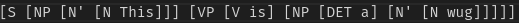
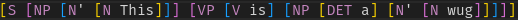
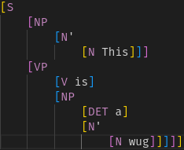
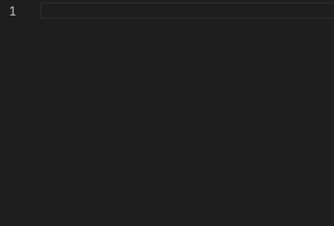

# linguistics-syntactic-tree

An extension to highlight and format linguistic syntactic trees.

## The file must have a `.lst` extension for this to work!

## Features

### Highlighting

### Formatting

### Completions

